# Daily Life Hacks Food Value Data

**22 datasets. 474 rows. Every grocery price and nutrient number behind the Daily Life Hacks cost studies, with the receipts attached.**

When we publish a line like "black beans give you 10.4 grams of fiber per dollar," that number didn't come from vibes. It came from a specific USDA FoodData Central entry divided by a specific shelf price, and both of those are written down in the row. This repo is where the rows live.

Two of these rankings run often enough that they got names: the **Fiber per Dollar Index** (53 foods scored on dietary fiber grams per dollar) and the **Protein per Dollar Index** (49 sources scored on protein grams per dollar). Everything else in here is a category cut, a head-to-head, or a daily-menu costing built on the same rules.

- Data hub: <https://www.daily-life-hacks.com/data/>
- Full methodology: <https://www.daily-life-hacks.com/methodology/>
- Machine-readable descriptor: [`datapackage.json`](datapackage.json) (Frictionless `tabular-data-package`, with per-field types and descriptions for all 22 files)

---

## What's actually in here

Every file answers one version of the same question: what do you get for a dollar? Fiber per dollar, protein per dollar, protein adjusted for quality with DIAAS, what a day of hitting your fiber target actually costs, and the same math sliced by aisle - produce, grains, legumes, dairy, meat, pantry staples, fast food.

It's US national retail pricing, observed July 2026, against USDA nutrient values. It is not a modeling benchmark and it's not a global price series. It's a snapshot of what American groceries cost and what nutrition you get back.

```
.
├── data/            22 CSVs, UTF-8, comma-delimited, header row included
├── charts/          22 matplotlib charts, one per dataset
├── examples/        two runnable scripts (Python + JavaScript)
├── datapackage.json Frictionless descriptor with the full field schema
├── CITATION.cff     how to cite this
└── CHANGELOG.md
```

---

## How the numbers were collected

Six rules. They're the whole reason this data is worth reusing.

**1. Nutrients come from USDA FoodData Central.** Not from a package label, not from a nutrition app that scraped a package label.

**2. Prices are US national figures.** BLS Average Price data where the item is tracked (those rows carry the series ID, like `APU0000708111`). Walmart national listings where it isn't. Observed July 2026. Every row states which one it used in `price_basis`, so you can tell a government series apart from a retailer listing at a glance.

**3. Everything is as-purchased, not as-served.** Dry lentils are priced and measured dry. Canned beans are measured drained, because nobody eats the can liquid on purpose. Where a study compares cooked values it says so and shows the conversion. Mixing "per 100g cooked" with "per 100g dry" is how you get rankings that look impressive and mean nothing.

**4. Refuse comes out before ranking.** A pound of oranges is not a pound of orange. Peels, pits, rinds and bone are removed using USDA refuse percentages before anything gets ranked. Skipping this step quietly flatters foods with heavy waste, like avocados, winter squash and bone-in cuts. Where it was applied, the row says so: `USDA SR28 refuse: 33% bone and cartilage`.

**5. Two independent pulls per value.** Every nutrient value was re-verified against two separate USDA queries in two separate sessions, compared line by line. Disagreements got flagged and resolved by hand before publication. It's tedious. That's the point - a ranking is only useful if the boring rows are as accurate as the surprising ones.

**6. Corrections are public and dated.** On July 4 2026 an adversarial audit of the fiber study caught six values that needed fixing. They were fixed, the affected foods were re-ranked, and a correction note went into the article. That audit is now a standard pre-publish step. Nothing gets quietly swapped.

The person doing this is David Miller, who runs the site. He's not a registered dietitian or a medical professional, and this data is built to make grocery math inspectable, not to hand anybody personal nutrition advice.

---

## Reading the columns

Most of the ranking files share a common shape:

| Column | What it means |
|---|---|
| `food` | The item as sold at retail, including the form (dry, canned, frozen, bone-in) where the form changes the math |
| `category` | Grocery category the food was grouped under for that ranking |
| `value` | The headline metric for that file - grams per dollar, after the edible fraction is applied |
| `package` | The package size the recorded price refers to, as sold on the shelf |
| `package_price_usd` | Shelf price in USD for that package |
| `price_basis` | Where the price came from, when it was observed, and any refuse percentage applied |

The two index files (`fiber-per-dollar-2026.csv`, `protein-per-dollar-2026.csv`) are wider - they expose the whole calculation chain: `fiber_g_per_100g` / `protein_g_per_100g`, `package_weight_g`, `edible_fraction`, `price_per_100g_usd`, and then the derived `*_g_per_dollar`. If you want to check our arithmetic rather than trust it, start there.

The per-file field schemas below are generated from `datapackage.json`, which is the authoritative version.

---

## The datasets

### 1. Animal Protein per Dollar, Ranked (2026)

21 animal-source foods (meat, poultry, eggs, dairy and seafood) ranked by grams of protein per US dollar. Prices are US national figures from BLS Average Price data where the item is tracked and Walmart national listings otherwise. Bone-in cuts have the USDA refuse percentage removed before ranking.

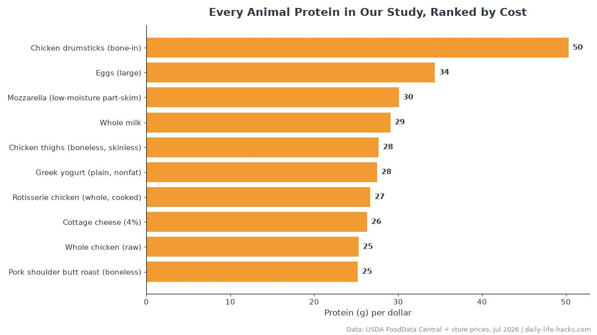

- **File:** [`data/animal-protein-per-dollar-ranked-2026.csv`](data/animal-protein-per-dollar-ranked-2026.csv)
- **Rows:** 21 (header excluded) &nbsp;|&nbsp; **Size:** 2,146 bytes
- **Chart:** [`charts/animal-protein-per-dollar-ranked-chart.jpg`](charts/animal-protein-per-dollar-ranked-chart.jpg)
- **Study:** <https://www.daily-life-hacks.com/animal-protein-per-dollar-ranked/>

| Field | Type | Description |
|---|---|---|
| `food` | string | Food item as sold at retail, including the form (dry, canned, frozen, bone-in) where the form changes the math. |
| `category` | string | Grocery category the food was grouped under for this ranking. |
| `value` | number | Grams of protein per US dollar spent, after the edible fraction is applied. |
| `package` | string | Package size the recorded price refers to, as sold on the shelf. |
| `package_price_usd` | number | Shelf price in US dollars for that package. |
| `price_basis` | string | Source and observation date for the price, plus any USDA refuse percentage applied. |

### 2. Beans Ranked by Fiber and Protein per Dollar (2026)

10 legumes and legume products scored on both nutrients at once, pairing dry beans against their canned equivalents. Each row carries protein per dollar, fiber per dollar, and the two added together. Canned rows are measured drained.

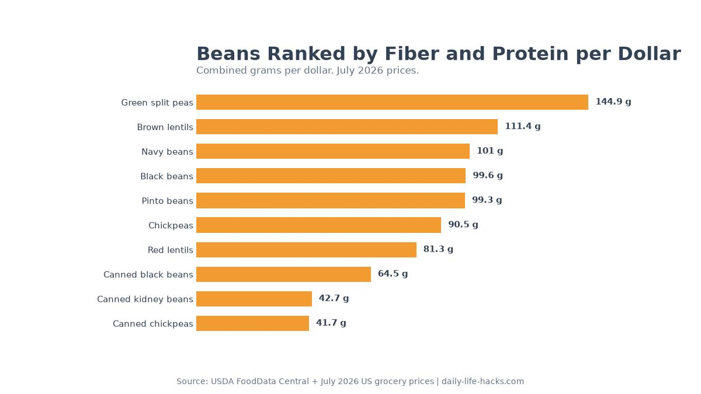

- **File:** [`data/beans-double-win-fiber-protein-2026.csv`](data/beans-double-win-fiber-protein-2026.csv)
- **Rows:** 10 (header excluded) &nbsp;|&nbsp; **Size:** 1,138 bytes
- **Chart:** [`charts/beans-double-win-fiber-protein-chart.jpg`](charts/beans-double-win-fiber-protein-chart.jpg)
- **Study:** <https://www.daily-life-hacks.com/beans-double-win-fiber-protein/>

| Field | Type | Description |
|---|---|---|
| `food` | string | Food item as sold at retail, including the form (dry, canned, frozen, bone-in) where the form changes the math. |
| `category` | string | Grocery category the food was grouped under for this ranking. |
| `value` | number | Combined grams of protein plus fiber per US dollar spent. |
| `protein_g_per_dollar` | number | Grams of protein per US dollar spent, after the edible fraction is applied. |
| `fiber_g_per_dollar` | number | Grams of dietary fiber per US dollar spent, after the edible fraction is applied. |
| `package` | string | Package size the recorded price refers to, as sold on the shelf. |
| `package_price_usd` | number | Shelf price in US dollars for that package. |
| `price_basis` | string | Source and observation date for the price, plus any USDA refuse percentage applied. |

### 3. Breakfast Staples by Nutrition per Dollar (2026)

9 common American breakfast foods (flour, oats, eggs, peanut butter, yogurt, fruit and similar) scored on protein per dollar and fiber per dollar. The fiber column is left blank for foods that carry effectively none.

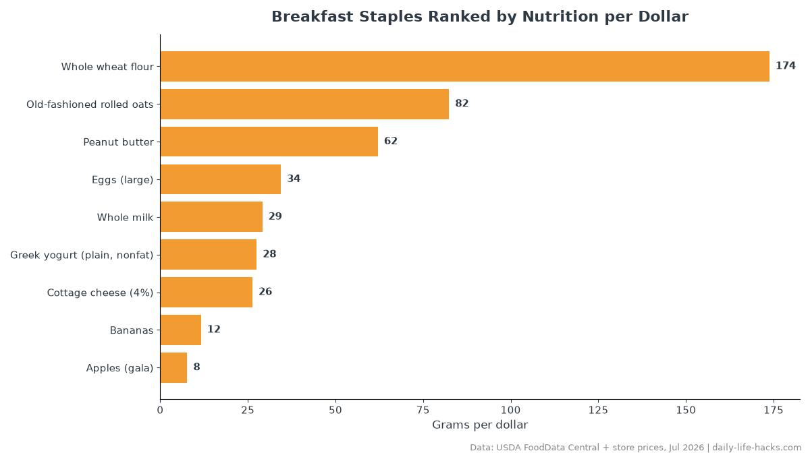

- **File:** [`data/breakfast-staples-per-dollar-2026.csv`](data/breakfast-staples-per-dollar-2026.csv)
- **Rows:** 9 (header excluded) &nbsp;|&nbsp; **Size:** 878 bytes
- **Chart:** [`charts/breakfast-staples-per-dollar-chart.jpg`](charts/breakfast-staples-per-dollar-chart.jpg)
- **Study:** <https://www.daily-life-hacks.com/breakfast-staples-per-dollar/>

| Field | Type | Description |
|---|---|---|
| `food` | string | Food item as sold at retail, including the form (dry, canned, frozen, bone-in) where the form changes the math. |
| `category` | string | Grocery category the food was grouped under for this ranking. |
| `value` | number | Combined grams of protein plus fiber per US dollar spent. |
| `protein_g_per_dollar` | number | Grams of protein per US dollar spent, after the edible fraction is applied. |
| `fiber_g_per_dollar` | number | Grams of dietary fiber per US dollar spent, after the edible fraction is applied. |
| `package` | string | Package size the recorded price refers to, as sold on the shelf. |
| `package_price_usd` | number | Shelf price in US dollars for that package. |
| `price_basis` | string | Source and observation date for the price, plus any USDA refuse percentage applied. |

### 4. Canned vs Dry Beans, Cost Compared (2026)

10 rows pairing dry beans and lentils against the canned version of the same legume, ranked by grams of protein per US dollar, to quantify what the convenience of a can costs. Canned rows are measured drained.

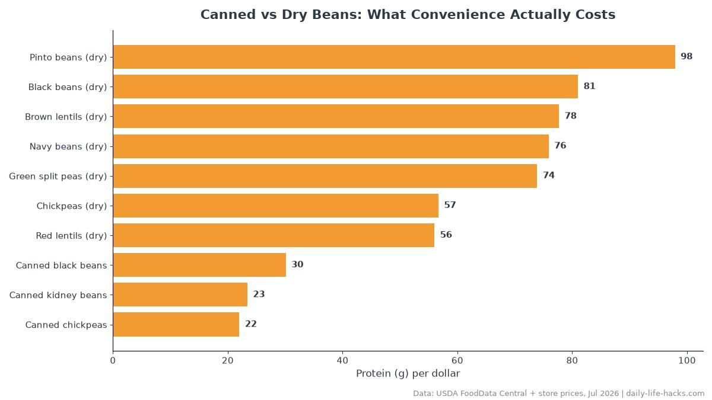

- **File:** [`data/canned-vs-dry-beans-cost-2026.csv`](data/canned-vs-dry-beans-cost-2026.csv)
- **Rows:** 10 (header excluded) &nbsp;|&nbsp; **Size:** 1,005 bytes
- **Chart:** [`charts/canned-vs-dry-beans-cost-chart.jpg`](charts/canned-vs-dry-beans-cost-chart.jpg)
- **Study:** <https://www.daily-life-hacks.com/canned-vs-dry-beans-cost/>

| Field | Type | Description |
|---|---|---|
| `food` | string | Food item as sold at retail, including the form (dry, canned, frozen, bone-in) where the form changes the math. |
| `category` | string | Grocery category the food was grouped under for this ranking. |
| `value` | number | Grams of protein per US dollar spent, after the edible fraction is applied. |
| `package` | string | Package size the recorded price refers to, as sold on the shelf. |
| `package_price_usd` | number | Shelf price in US dollars for that package. |
| `price_basis` | string | Source and observation date for the price, plus any USDA refuse percentage applied. |

### 5. Cheapest Complete-Protein Pairings (2026)

20 legume-and-grain combinations scored as complete-protein pairings. Each row is a two-food combo whose score is a 50/50 split of the dollars between two already-audited single-food rows, so the package and package price columns are intentionally empty and the component values are named in price_basis.

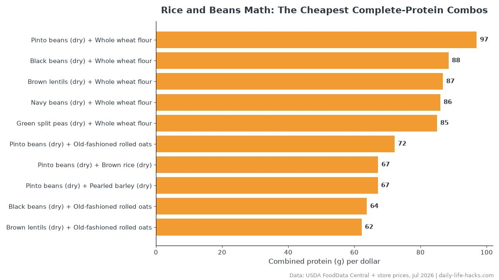

- **File:** [`data/cheapest-complete-protein-pairs-2026.csv`](data/cheapest-complete-protein-pairs-2026.csv)
- **Rows:** 20 (header excluded) &nbsp;|&nbsp; **Size:** 2,967 bytes
- **Chart:** [`charts/cheapest-complete-protein-pairs-chart.jpg`](charts/cheapest-complete-protein-pairs-chart.jpg)
- **Study:** <https://www.daily-life-hacks.com/cheapest-complete-protein-pairs/>

| Field | Type | Description |
|---|---|---|
| `food` | string | The two-food pairing, written as 'Food A + Food B'. |
| `category` | string | Always 'combo'. Every row in this dataset is a pairing, not a single food. |
| `value` | number | Combined grams of protein per US dollar for the pairing, on a 50/50 split of the dollars between the two component foods. |
| `package` | string | Not applicable to a pairing. Always empty in this dataset. |
| `package_price_usd` | number | Not applicable to a pairing. Always 0; the component package prices live in the single-food datasets. |
| `price_basis` | string | The two audited single-food rows the pairing score was derived from, with each one's protein per dollar. |

### 6. Dairy and Egg Protein per Dollar, Ranked (2026)

6 dairy-case staples (eggs, milk, cottage cheese, Greek yogurt, mozzarella and cheddar) ranked by grams of protein per US dollar.

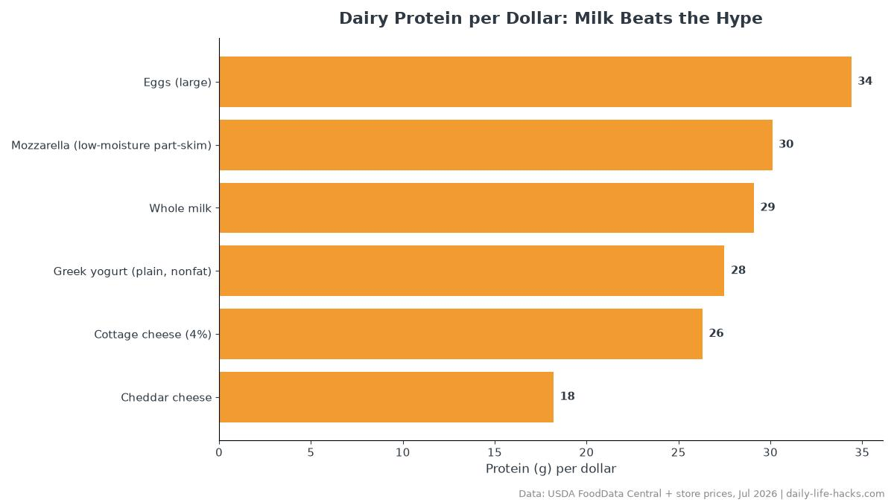

- **File:** [`data/dairy-protein-per-dollar-ranked-2026.csv`](data/dairy-protein-per-dollar-ranked-2026.csv)
- **Rows:** 6 (header excluded) &nbsp;|&nbsp; **Size:** 568 bytes
- **Chart:** [`charts/dairy-protein-per-dollar-ranked-chart.jpg`](charts/dairy-protein-per-dollar-ranked-chart.jpg)
- **Study:** <https://www.daily-life-hacks.com/dairy-protein-per-dollar-ranked/>

| Field | Type | Description |
|---|---|---|
| `food` | string | Food item as sold at retail, including the form (dry, canned, frozen, bone-in) where the form changes the math. |
| `category` | string | Grocery category the food was grouped under for this ranking. |
| `value` | number | Grams of protein per US dollar spent, after the edible fraction is applied. |
| `package` | string | Package size the recorded price refers to, as sold on the shelf. |
| `package_price_usd` | number | Shelf price in US dollars for that package. |
| `price_basis` | string | Source and observation date for the price, plus any USDA refuse percentage applied. |

### 7. Eggs vs Every Other Protein Source (2026)

The full 49-food protein ranking used to place eggs against every other source in the study, plant and animal, ordered by grams of protein per US dollar.

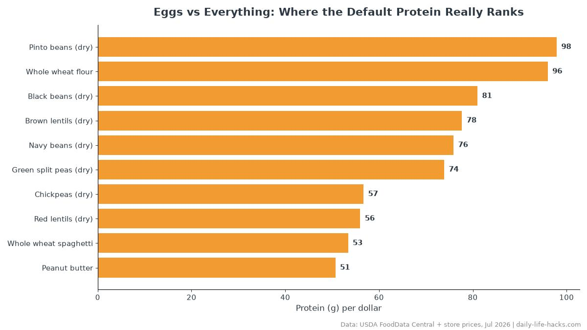

- **File:** [`data/eggs-vs-everything-protein-value-2026.csv`](data/eggs-vs-everything-protein-value-2026.csv)
- **Rows:** 49 (header excluded) &nbsp;|&nbsp; **Size:** 4,770 bytes
- **Chart:** [`charts/eggs-vs-everything-protein-value-chart.jpg`](charts/eggs-vs-everything-protein-value-chart.jpg)
- **Study:** <https://www.daily-life-hacks.com/eggs-vs-everything-protein-value/>

| Field | Type | Description |
|---|---|---|
| `food` | string | Food item as sold at retail, including the form (dry, canned, frozen, bone-in) where the form changes the math. |
| `category` | string | Grocery category the food was grouped under for this ranking. |
| `value` | number | Grams of protein per US dollar spent, after the edible fraction is applied. |
| `package` | string | Package size the recorded price refers to, as sold on the shelf. |
| `package_price_usd` | number | Shelf price in US dollars for that package. |
| `price_basis` | string | Source and observation date for the price, plus any USDA refuse percentage applied. |

### 8. Fast Food Protein per Dollar (2026)

30 menu items from major US fast food chains ranked by grams of protein per US dollar. Protein figures come from each chain's own published nutrition data and prices from national averages or dated store menu snapshots. Both are recorded per row, and items from chains that publish no nutrition data were excluded.

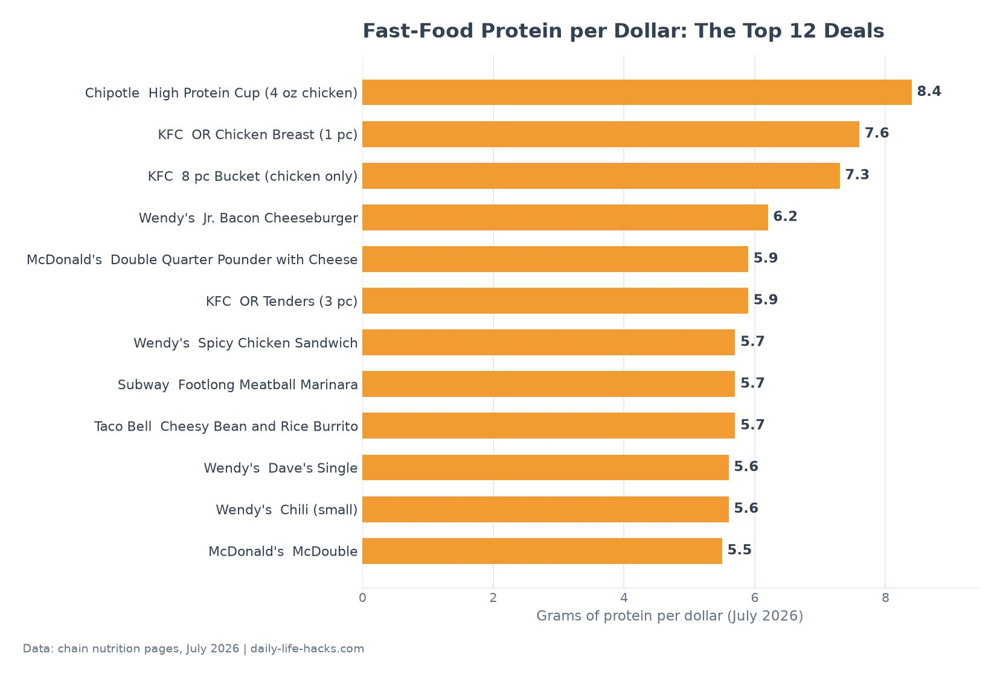

- **File:** [`data/fastfood-protein-per-dollar-2026.csv`](data/fastfood-protein-per-dollar-2026.csv)
- **Rows:** 30 (header excluded) &nbsp;|&nbsp; **Size:** 5,654 bytes
- **Chart:** [`charts/fast-food-protein-per-dollar-ranked-chart.jpg`](charts/fast-food-protein-per-dollar-ranked-chart.jpg)
- **Study:** <https://www.daily-life-hacks.com/fast-food-protein-per-dollar-ranked/>

| Field | Type | Description |
|---|---|---|
| `chain` | string | Fast food chain the menu item belongs to. |
| `item` | string | Menu item name as the chain publishes it. |
| `protein_g` | number | Protein in grams per menu item as served. |
| `price_usd` | number | Menu price in US dollars for that item. |
| `protein_g_per_dollar` | number | Grams of protein per US dollar spent, after the edible fraction is applied. |
| `source` | string | Where the nutrition figure came from, including the independent re-verification. |
| `price_basis` | string | Source and observation date for the price, plus any USDA refuse percentage applied. |

### 9. Cost of 30 Grams of Fiber per Day, Five Menus (2026)

27 meal components making up 5 complete single-day menus, each built to reach roughly 30 grams of dietary fiber. Every row records the food, the grams used, the fiber that portion contributes, and what it cost at the audited price.

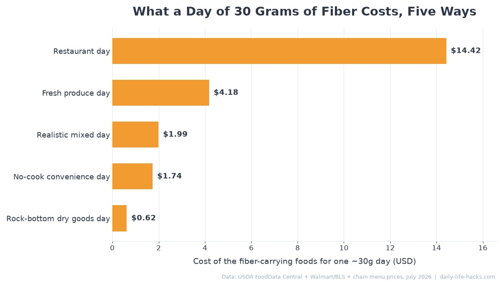

- **File:** [`data/fiber-day-cost-2026.csv`](data/fiber-day-cost-2026.csv)
- **Rows:** 27 (header excluded) &nbsp;|&nbsp; **Size:** 3,055 bytes
- **Chart:** [`charts/what-30-grams-of-fiber-costs-five-ways-chart.jpg`](charts/what-30-grams-of-fiber-costs-five-ways-chart.jpg)
- **Study:** <https://www.daily-life-hacks.com/what-30-grams-of-fiber-costs-per-day/>

| Field | Type | Description |
|---|---|---|
| `day` | string | Menu day label. Each day is one complete plan built to a single nutrient target. |
| `meal` | string | Meal slot the component belongs to within that day. |
| `food` | string | Food item as sold at retail, including the form (dry, canned, frozen, bone-in) where the form changes the math. |
| `grams_used` | integer | Grams of the food used in that meal component. |
| `fiber_g` | number | Grams of dietary fiber contributed by this meal component. |
| `cost_usd` | number | Cost in US dollars of this portion at the audited price. |
| `basis` | string | The parent dataset row the price and nutrient value were taken from. |

### 10. Fiber per Dollar: 53 Foods Ranked (2026)

The flagship fiber dataset. 53 foods ranked by grams of dietary fiber per US dollar with the whole calculation exposed: USDA fiber per 100g, package size and price, package weight, edible fraction, and the derived price per 100 grams.

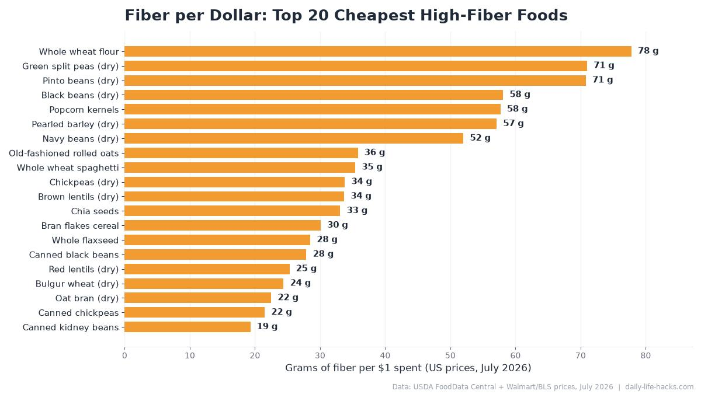

- **File:** [`data/fiber-per-dollar-2026.csv`](data/fiber-per-dollar-2026.csv)
- **Rows:** 53 (header excluded) &nbsp;|&nbsp; **Size:** 4,523 bytes
- **Chart:** [`charts/fiber-per-dollar-top-20-chart.jpg`](charts/fiber-per-dollar-top-20-chart.jpg)
- **Study:** <https://www.daily-life-hacks.com/fiber-per-dollar-cheapest-high-fiber-foods/>

| Field | Type | Description |
|---|---|---|
| `rank` | integer | Position in the ranking. 1 is the most nutrient per dollar. |
| `food` | string | Food item as sold at retail, including the form (dry, canned, frozen, bone-in) where the form changes the math. |
| `category` | string | Grocery category the food was grouped under for this ranking. |
| `fiber_g_per_100g` | number | Dietary fiber in grams per 100 grams of the food as purchased, from USDA FoodData Central. |
| `package` | string | Package size the recorded price refers to, as sold on the shelf. |
| `package_price_usd` | number | Shelf price in US dollars for that package. |
| `package_weight_g` | number | Net weight of that package in grams. |
| `edible_fraction` | number | Share of the purchased weight that is actually eaten, after USDA refuse (peels, pits, rinds, bone) is removed. 1.0 means no waste. |
| `price_per_100g_usd` | number | Price in US dollars per 100 grams of edible food. |
| `fiber_g_per_dollar` | number | Grams of dietary fiber per US dollar spent, after the edible fraction is applied. |
| `price_basis` | string | Source and observation date for the price, plus any USDA refuse percentage applied. |

### 11. Grains Ranked by Fiber per Dollar (2026)

11 grains and grain products (whole wheat flour, popcorn, oats, barley, brown rice, pasta, quinoa and similar) ranked by grams of dietary fiber per US dollar.

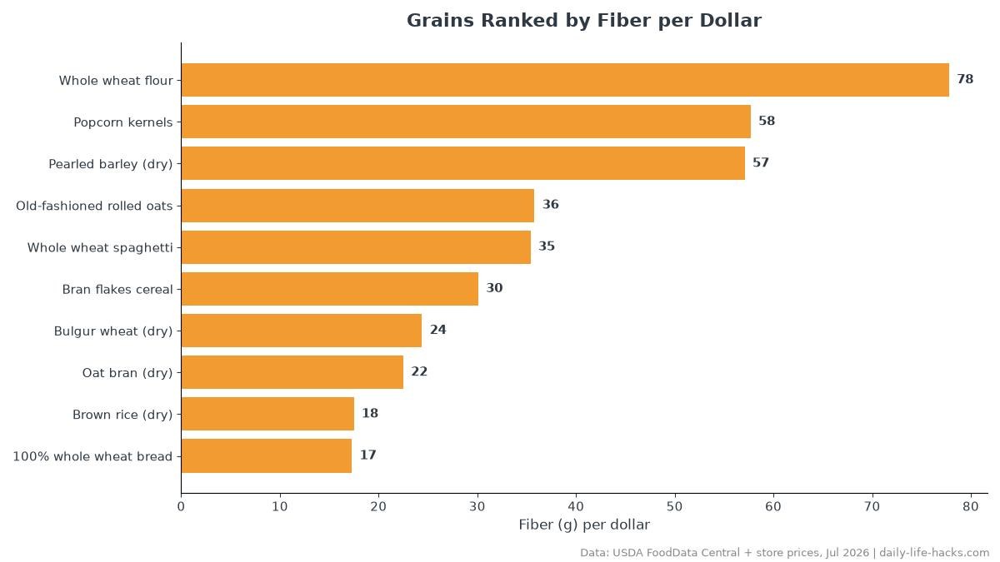

- **File:** [`data/grains-fiber-per-dollar-ranked-2026.csv`](data/grains-fiber-per-dollar-ranked-2026.csv)
- **Rows:** 11 (header excluded) &nbsp;|&nbsp; **Size:** 761 bytes
- **Chart:** [`charts/grains-fiber-per-dollar-ranked-chart.jpg`](charts/grains-fiber-per-dollar-ranked-chart.jpg)
- **Study:** <https://www.daily-life-hacks.com/grains-fiber-per-dollar-ranked/>

| Field | Type | Description |
|---|---|---|
| `food` | string | Food item as sold at retail, including the form (dry, canned, frozen, bone-in) where the form changes the math. |
| `category` | string | Grocery category the food was grouped under for this ranking. |
| `value` | number | Grams of dietary fiber per US dollar spent, after the edible fraction is applied. |
| `package` | string | Package size the recorded price refers to, as sold on the shelf. |
| `package_price_usd` | number | Shelf price in US dollars for that package. |
| `price_basis` | string | Source and observation date for the price, plus any USDA refuse percentage applied. |

### 12. High-Fiber Snacks Ranked by Cost (2026)

10 snackable foods ranked by grams of dietary fiber per US dollar, limited to items you would eat between meals with little or no preparation.

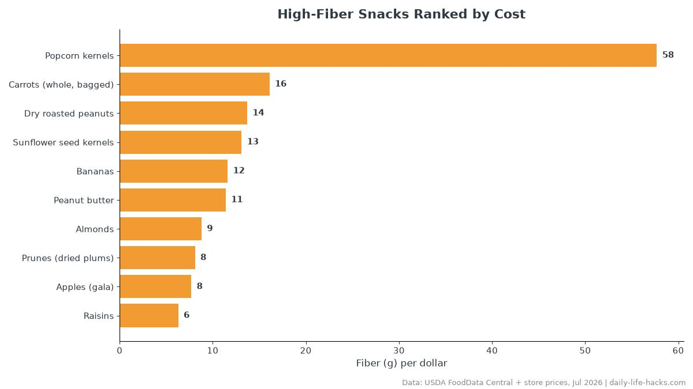

- **File:** [`data/high-fiber-snacks-per-dollar-2026.csv`](data/high-fiber-snacks-per-dollar-2026.csv)
- **Rows:** 10 (header excluded) &nbsp;|&nbsp; **Size:** 648 bytes
- **Chart:** [`charts/high-fiber-snacks-per-dollar-chart.jpg`](charts/high-fiber-snacks-per-dollar-chart.jpg)
- **Study:** <https://www.daily-life-hacks.com/high-fiber-snacks-per-dollar/>

| Field | Type | Description |
|---|---|---|
| `food` | string | Food item as sold at retail, including the form (dry, canned, frozen, bone-in) where the form changes the math. |
| `category` | string | Grocery category the food was grouped under for this ranking. |
| `value` | number | Grams of dietary fiber per US dollar spent, after the edible fraction is applied. |
| `package` | string | Package size the recorded price refers to, as sold on the shelf. |
| `package_price_usd` | number | Shelf price in US dollars for that package. |
| `price_basis` | string | Source and observation date for the price, plus any USDA refuse percentage applied. |

### 13. Meat per Dollar: 11 Cuts Ranked by Protein Value (2026)

11 cuts of meat and poultry ranked by grams of protein per US dollar. Bone-in cuts have the USDA refuse percentage for bone and cartilage removed before the ranking, so they are not credited for weight nobody eats.

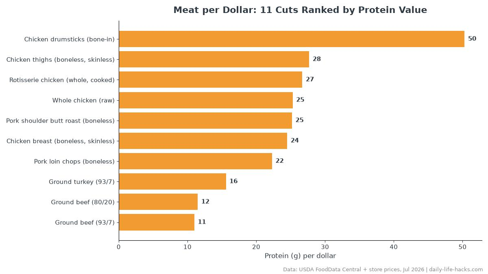

- **File:** [`data/meat-per-dollar-protein-ranked-2026.csv`](data/meat-per-dollar-protein-ranked-2026.csv)
- **Rows:** 11 (header excluded) &nbsp;|&nbsp; **Size:** 1,234 bytes
- **Chart:** [`charts/meat-per-dollar-protein-ranked-chart.jpg`](charts/meat-per-dollar-protein-ranked-chart.jpg)
- **Study:** <https://www.daily-life-hacks.com/meat-per-dollar-protein-ranked/>

| Field | Type | Description |
|---|---|---|
| `food` | string | Food item as sold at retail, including the form (dry, canned, frozen, bone-in) where the form changes the math. |
| `category` | string | Grocery category the food was grouped under for this ranking. |
| `value` | number | Grams of protein per US dollar spent, after the edible fraction is applied. |
| `package` | string | Package size the recorded price refers to, as sold on the shelf. |
| `package_price_usd` | number | Shelf price in US dollars for that package. |
| `price_basis` | string | Source and observation date for the price, plus any USDA refuse percentage applied. |

### 14. Cheapest Protein That Needs No Cooking (2026)

15 protein sources that need no cooking at all, ranked by grams of protein per US dollar. Scoped to foods edible straight from the package or the fridge.

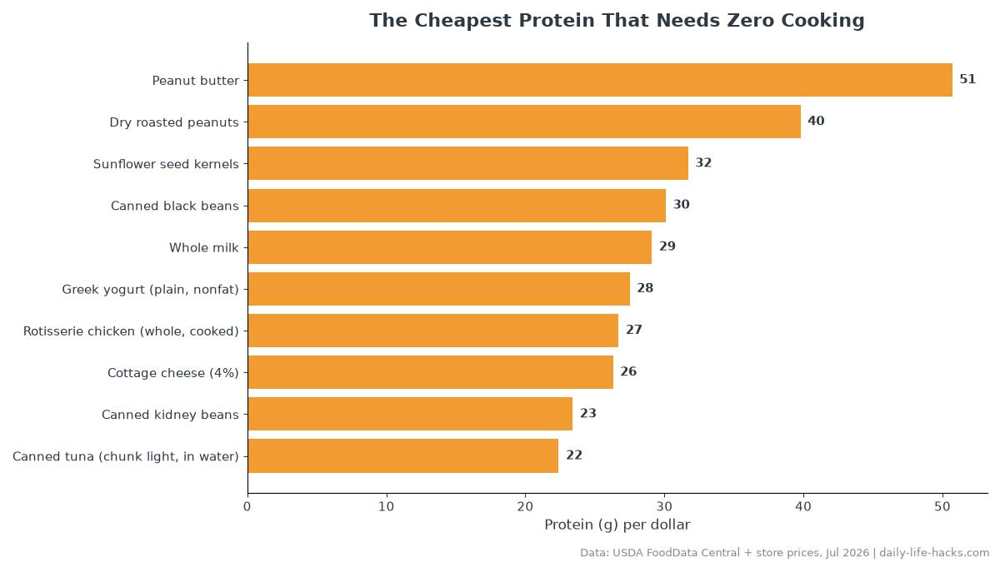

- **File:** [`data/no-cook-protein-per-dollar-2026.csv`](data/no-cook-protein-per-dollar-2026.csv)
- **Rows:** 15 (header excluded) &nbsp;|&nbsp; **Size:** 1,486 bytes
- **Chart:** [`charts/no-cook-protein-per-dollar-chart.jpg`](charts/no-cook-protein-per-dollar-chart.jpg)
- **Study:** <https://www.daily-life-hacks.com/no-cook-protein-per-dollar/>

| Field | Type | Description |
|---|---|---|
| `food` | string | Food item as sold at retail, including the form (dry, canned, frozen, bone-in) where the form changes the math. |
| `category` | string | Grocery category the food was grouped under for this ranking. |
| `value` | number | Grams of protein per US dollar spent, after the edible fraction is applied. |
| `package` | string | Package size the recorded price refers to, as sold on the shelf. |
| `package_price_usd` | number | Shelf price in US dollars for that package. |
| `price_basis` | string | Source and observation date for the price, plus any USDA refuse percentage applied. |

### 15. What One Dollar of Fiber Buys (2026)

15 foods showing what a single US dollar buys in grams of dietary fiber, ranked from most to least, spanning whole grains, dried and canned legumes, and produce.

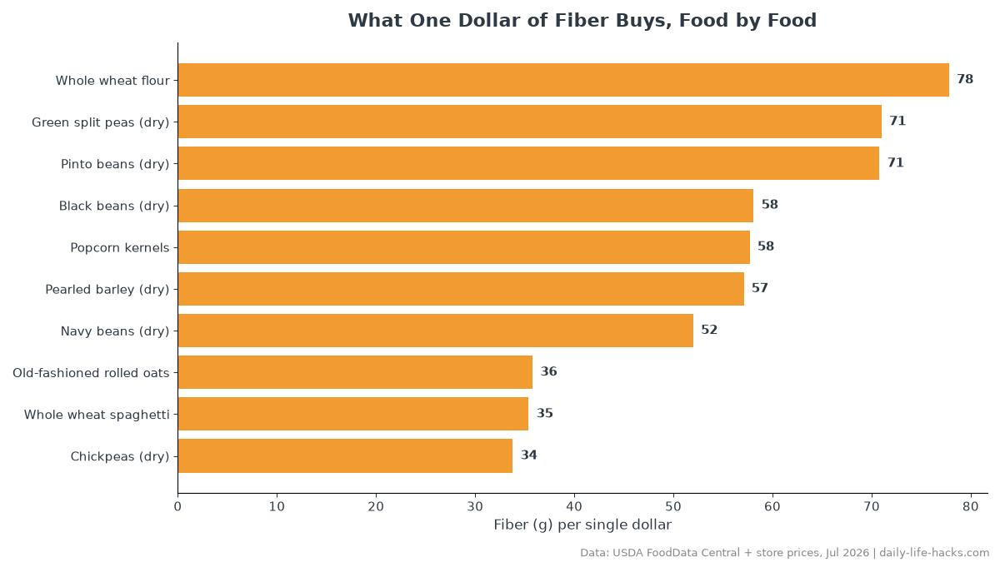

- **File:** [`data/one-dollar-fiber-what-it-buys-2026.csv`](data/one-dollar-fiber-what-it-buys-2026.csv)
- **Rows:** 15 (header excluded) &nbsp;|&nbsp; **Size:** 1,041 bytes
- **Chart:** [`charts/one-dollar-fiber-what-it-buys-chart.jpg`](charts/one-dollar-fiber-what-it-buys-chart.jpg)
- **Study:** <https://www.daily-life-hacks.com/one-dollar-fiber-what-it-buys/>

| Field | Type | Description |
|---|---|---|
| `food` | string | Food item as sold at retail, including the form (dry, canned, frozen, bone-in) where the form changes the math. |
| `category` | string | Grocery category the food was grouped under for this ranking. |
| `value` | number | Grams of dietary fiber per US dollar spent, after the edible fraction is applied. |
| `package` | string | Package size the recorded price refers to, as sold on the shelf. |
| `package_price_usd` | number | Shelf price in US dollars for that package. |
| `price_basis` | string | Source and observation date for the price, plus any USDA refuse percentage applied. |

### 16. What One Dollar of Protein Buys (2026)

15 foods showing what a single US dollar buys in grams of protein, ranked from most to least, spanning legumes, grains, dairy, eggs, meat and nuts.

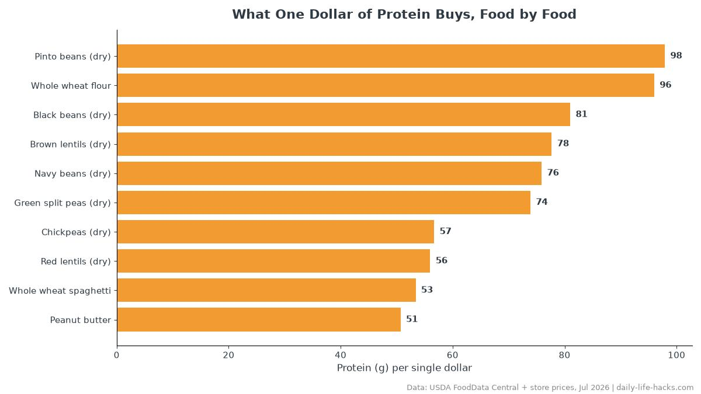

- **File:** [`data/one-dollar-protein-what-it-buys-2026.csv`](data/one-dollar-protein-what-it-buys-2026.csv)
- **Rows:** 15 (header excluded) &nbsp;|&nbsp; **Size:** 1,490 bytes
- **Chart:** [`charts/one-dollar-protein-what-it-buys-chart.jpg`](charts/one-dollar-protein-what-it-buys-chart.jpg)
- **Study:** <https://www.daily-life-hacks.com/one-dollar-protein-what-it-buys/>

| Field | Type | Description |
|---|---|---|
| `food` | string | Food item as sold at retail, including the form (dry, canned, frozen, bone-in) where the form changes the math. |
| `category` | string | Grocery category the food was grouped under for this ranking. |
| `value` | number | Grams of protein per US dollar spent, after the edible fraction is applied. |
| `package` | string | Package size the recorded price refers to, as sold on the shelf. |
| `package_price_usd` | number | Shelf price in US dollars for that package. |
| `price_basis` | string | Source and observation date for the price, plus any USDA refuse percentage applied. |

### 17. Plant Protein per Dollar: 18 Sources Ranked (2026)

18 plant protein sources (dried beans and lentils, grains, nuts, seeds and soy foods) ranked by grams of protein per US dollar.

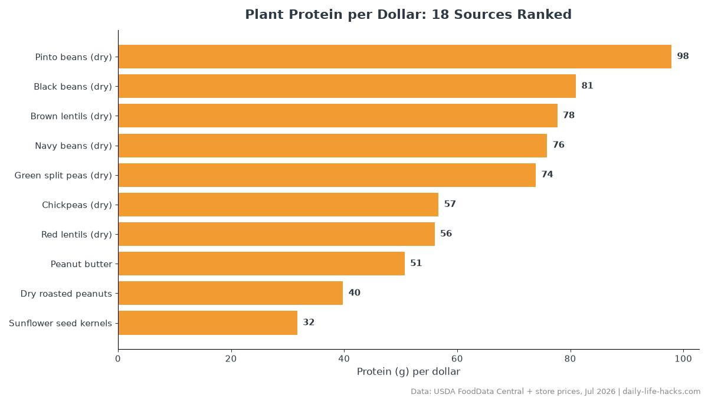

- **File:** [`data/plant-protein-per-dollar-ranked-2026.csv`](data/plant-protein-per-dollar-ranked-2026.csv)
- **Rows:** 18 (header excluded) &nbsp;|&nbsp; **Size:** 1,765 bytes
- **Chart:** [`charts/plant-protein-per-dollar-ranked-chart.jpg`](charts/plant-protein-per-dollar-ranked-chart.jpg)
- **Study:** <https://www.daily-life-hacks.com/plant-protein-per-dollar-ranked/>

| Field | Type | Description |
|---|---|---|
| `food` | string | Food item as sold at retail, including the form (dry, canned, frozen, bone-in) where the form changes the math. |
| `category` | string | Grocery category the food was grouped under for this ranking. |
| `value` | number | Grams of protein per US dollar spent, after the edible fraction is applied. |
| `package` | string | Package size the recorded price refers to, as sold on the shelf. |
| `package_price_usd` | number | Shelf price in US dollars for that package. |
| `price_basis` | string | Source and observation date for the price, plus any USDA refuse percentage applied. |

### 18. Fruits and Vegetables Ranked by Fiber per Dollar (2026)

22 fresh, frozen and dried fruits and vegetables ranked by grams of dietary fiber per US dollar. Edible fraction is applied first, so peels, pits and rinds do not flatter the heavy-waste items.

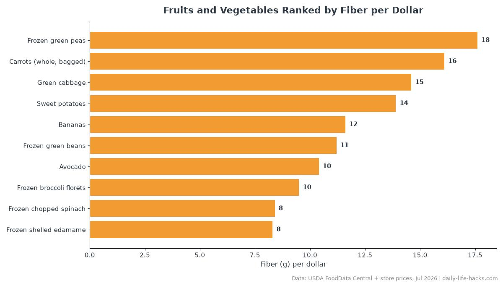

- **File:** [`data/produce-fiber-per-dollar-ranked-2026.csv`](data/produce-fiber-per-dollar-ranked-2026.csv)
- **Rows:** 22 (header excluded) &nbsp;|&nbsp; **Size:** 1,377 bytes
- **Chart:** [`charts/produce-fiber-per-dollar-ranked-chart.jpg`](charts/produce-fiber-per-dollar-ranked-chart.jpg)
- **Study:** <https://www.daily-life-hacks.com/produce-fiber-per-dollar-ranked/>

| Field | Type | Description |
|---|---|---|
| `food` | string | Food item as sold at retail, including the form (dry, canned, frozen, bone-in) where the form changes the math. |
| `category` | string | Grocery category the food was grouped under for this ranking. |
| `value` | number | Grams of dietary fiber per US dollar spent, after the edible fraction is applied. |
| `package` | string | Package size the recorded price refers to, as sold on the shelf. |
| `package_price_usd` | number | Shelf price in US dollars for that package. |
| `price_basis` | string | Source and observation date for the price, plus any USDA refuse percentage applied. |

### 19. Cost of 50 Grams of Protein per Day, Five Menus (2026)

21 meal components making up 5 complete single-day menus, each built to reach roughly 50 grams of protein. Every row records the food, the grams used, the protein that portion contributes, and what it cost at the audited price.

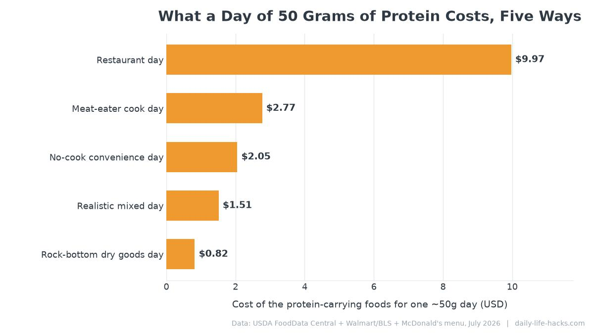

- **File:** [`data/protein-day-cost-2026.csv`](data/protein-day-cost-2026.csv)
- **Rows:** 21 (header excluded) &nbsp;|&nbsp; **Size:** 2,448 bytes
- **Chart:** [`charts/what-50-grams-of-protein-costs-five-ways-chart.jpg`](charts/what-50-grams-of-protein-costs-five-ways-chart.jpg)
- **Study:** <https://www.daily-life-hacks.com/what-50-grams-of-protein-costs-per-day/>

| Field | Type | Description |
|---|---|---|
| `day` | string | Menu day label. Each day is one complete plan built to a single nutrient target. |
| `meal` | string | Meal slot the component belongs to within that day. |
| `food` | string | Food item as sold at retail, including the form (dry, canned, frozen, bone-in) where the form changes the math. |
| `grams_used` | integer | Grams of the food used in that meal component. |
| `protein_g` | number | Grams of protein contributed by this meal component. |
| `cost_usd` | number | Cost in US dollars of this portion at the audited price. |
| `basis` | string | The parent dataset row the price and nutrient value were taken from. |

### 20. Protein per Dollar: 49 Sources Ranked (2026)

The flagship protein dataset. 49 foods ranked by grams of protein per US dollar with the whole calculation exposed: USDA protein per 100g, package size and price, package weight, edible fraction, and the derived price per 100 grams.

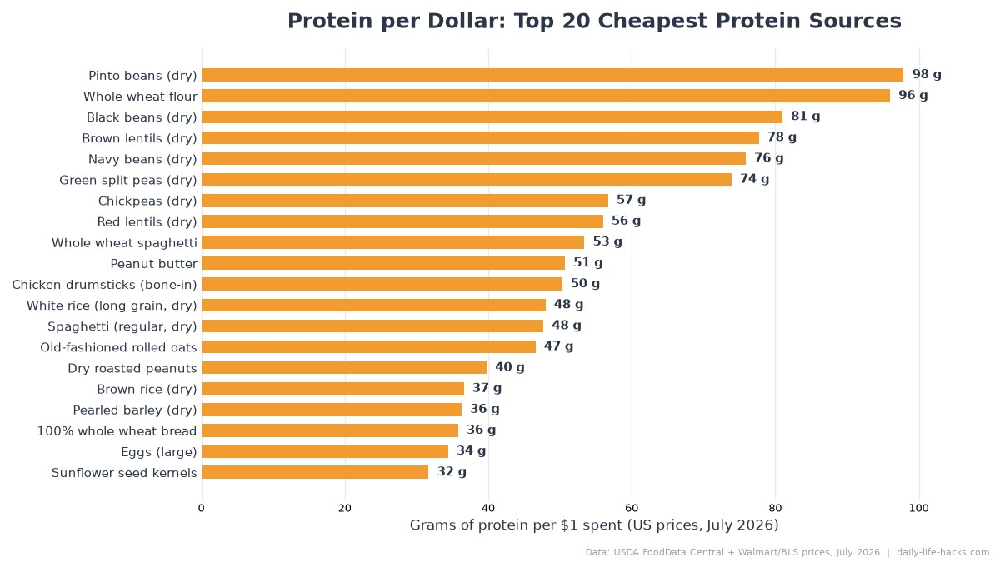

- **File:** [`data/protein-per-dollar-2026.csv`](data/protein-per-dollar-2026.csv)
- **Rows:** 49 (header excluded) &nbsp;|&nbsp; **Size:** 5,973 bytes
- **Chart:** [`charts/protein-per-dollar-top-20-chart.jpg`](charts/protein-per-dollar-top-20-chart.jpg)
- **Study:** <https://www.daily-life-hacks.com/protein-per-dollar-cheapest-protein-sources/>

| Field | Type | Description |
|---|---|---|
| `rank` | integer | Position in the ranking. 1 is the most nutrient per dollar. |
| `food` | string | Food item as sold at retail, including the form (dry, canned, frozen, bone-in) where the form changes the math. |
| `category` | string | Grocery category the food was grouped under for this ranking. |
| `protein_g_per_100g` | number | Protein in grams per 100 grams of the food as purchased, from USDA FoodData Central. |
| `package` | string | Package size the recorded price refers to, as sold on the shelf. |
| `package_price_usd` | number | Shelf price in US dollars for that package. |
| `package_weight_g` | number | Net weight of that package in grams. |
| `edible_fraction` | number | Share of the purchased weight that is actually eaten, after USDA refuse (peels, pits, rinds, bone) is removed. 1.0 means no waste. |
| `price_per_100g_usd` | number | Price in US dollars per 100 grams of edible food. |
| `protein_g_per_dollar` | number | Grams of protein per US dollar spent, after the edible fraction is applied. |
| `price_basis` | string | Source and observation date for the price, plus any USDA refuse percentage applied. |

### 21. Protein per Dollar Adjusted for Quality, DIAAS (2026)

25 protein sources whose raw protein-per-dollar figure is multiplied by a published DIAAS digestibility score, capped at 1.00, to give usable protein per dollar. Every DIAAS value names the peer-reviewed measurement it came from.

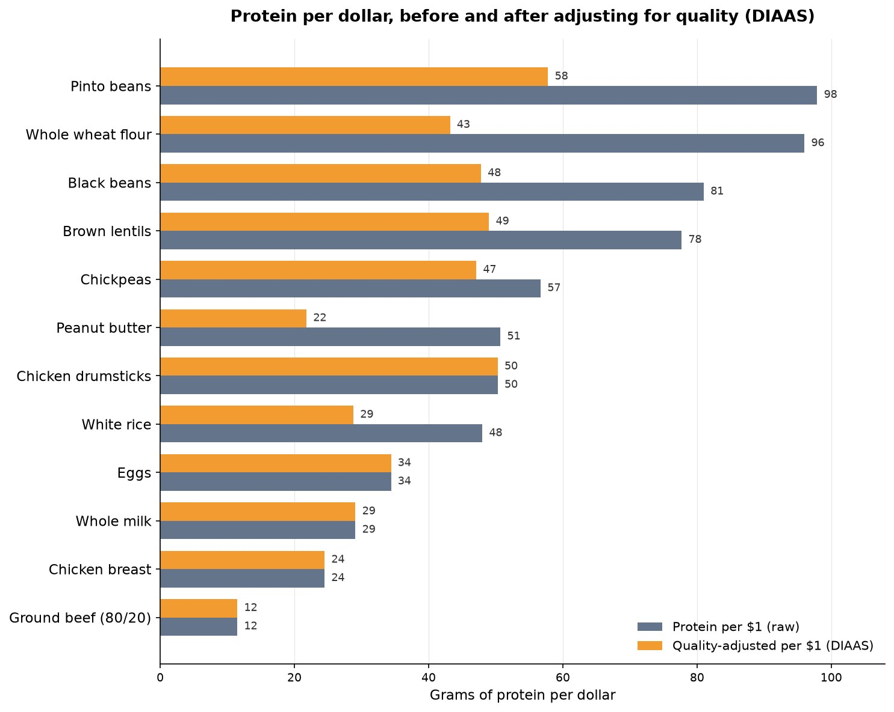

- **File:** [`data/protein-quality-per-dollar-2026.csv`](data/protein-quality-per-dollar-2026.csv)
- **Rows:** 25 (header excluded) &nbsp;|&nbsp; **Size:** 3,204 bytes
- **Chart:** [`charts/protein-per-dollar-adjusted-for-quality-chart.jpg`](charts/protein-per-dollar-adjusted-for-quality-chart.jpg)
- **Study:** <https://www.daily-life-hacks.com/protein-per-dollar-adjusted-for-quality/>

| Field | Type | Description |
|---|---|---|
| `food` | string | Food item as sold at retail, including the form (dry, canned, frozen, bone-in) where the form changes the math. |
| `protein_g_per_dollar` | number | Grams of protein per US dollar spent, after the edible fraction is applied. |
| `diaas_score` | number | DIAAS (Digestible Indispensable Amino Acid Score) for the protein source, as measured in the cited peer-reviewed study. |
| `diaas_capped_for_multiplication` | number | The DIAAS value capped at 1.00 before multiplying, so a complete protein is not credited above 100 percent usable. |
| `diaas_method` | string | Scoring method used for the quality adjustment. |
| `diaas_source` | string | Peer-reviewed study the DIAAS value was taken from. |
| `adjusted_g_per_dollar` | number | Protein grams per dollar multiplied by the capped DIAAS score: usable protein per US dollar. |
| `notes` | string | Free-text note on the amino acid profile or the proxy food used for scoring. |

### 22. The Shelf-Stable Pantry, Ranked by Protein per Dollar (2026)

27 shelf-stable pantry foods ranked by grams of protein per US dollar. Nothing in this dataset needs refrigeration, so it doubles as a stock-up list.


- **File:** [`data/shelf-stable-pantry-per-dollar-2026.csv`](data/shelf-stable-pantry-per-dollar-2026.csv)
- **Rows:** 27 (header excluded) &nbsp;|&nbsp; **Size:** 2,575 bytes
- **Chart:** [`charts/shelf-stable-pantry-per-dollar-chart.jpg`](charts/shelf-stable-pantry-per-dollar-chart.jpg)
- **Study:** <https://www.daily-life-hacks.com/shelf-stable-pantry-per-dollar/>

| Field | Type | Description |
|---|---|---|
| `food` | string | Food item as sold at retail, including the form (dry, canned, frozen, bone-in) where the form changes the math. |
| `category` | string | Grocery category the food was grouped under for this ranking. |
| `value` | number | Grams of protein per US dollar spent, after the edible fraction is applied. |
| `package` | string | Package size the recorded price refers to, as sold on the shelf. |
| `package_price_usd` | number | Shelf price in US dollars for that package. |
| `price_basis` | string | Source and observation date for the price, plus any USDA refuse percentage applied. |

---

## Examples

Two scripts in [`examples/`](examples/). Both read the CSVs straight out of `data/` with no dependencies beyond the standard library, and both answer a question you'd actually ask.

- [`examples/cheapest_protein.py`](examples/cheapest_protein.py) - Python. Ranks protein sources by cost to hit a 50 g daily target, then shows what DIAAS quality adjustment does to that ranking. Spoiler: it reshuffles the top of the board.
- [`examples/fiber_gap.mjs`](examples/fiber_gap.mjs) - Node. Works out the cheapest way to close the gap between what Americans typically eat (about 16 g of fiber a day) and the 28 g Daily Value, and prices the cheapest single-food fix.

Expected output for both is committed in [`examples/README.md`](examples/README.md).

---

## Reuse and attribution

You're welcome to use this data. We ask for two things, and they're the same two things any reader would want:

1. Credit **Daily Life Hacks**.
2. Link back to the study page the data came from, or to <https://www.daily-life-hacks.com/data/>, so whoever reads your version can check the methodology too.

Full license scope and copy-ready attribution: <https://www.daily-life-hacks.com/data-reuse/>

Copy-paste credit line:

```html
Data: <a href="https://www.daily-life-hacks.com/data/">Daily Life Hacks Food Value Data</a>
```

---

## How to cite

Machine-readable version: [`CITATION.cff`](CITATION.cff). GitHub renders a "Cite this repository" button from it, and `cffconvert` will turn it into BibTeX or APA.

**APA**

> Miller, D. (2026). *Daily Life Hacks Food Value Data* (Version 2026.1) \[Data set\]. Daily Life Hacks. https://www.daily-life-hacks.com/data/

**BibTeX**

```bibtex
@dataset{dailylifehacks_food_value_2026,
  author    = {Miller, David},
  title     = {Daily Life Hacks Food Value Data},
  year      = {2026},
  version   = {2026.1},
  publisher = {Daily Life Hacks},
  url       = {https://www.daily-life-hacks.com/data/}
}
```

When you cite a single ranking rather than the whole collection, cite the study page for that file - the per-dataset **Study** links above - because that's where the correction notes get published.

---

## Limits worth knowing before you use it

- **It's a July 2026 snapshot.** Grocery prices move. A per-dollar ranking with stale prices is a per-nothing ranking. Prices get a full re-audit quarterly and the BLS staples get checked monthly, so check the version before you build on it.
- **It's US national.** Regional pricing swings hard, especially on produce and dairy.
- **Walmart-sourced rows are one retailer.** They're labeled as such in `price_basis`. BLS rows are national averages and carry more weight.
- **The public exports don't carry the FoodData Central ID column.** We're not going to pretend they do. The nutrient values trace to FDC; the row-level ID isn't in the export yet.
- **Cost rankings aren't nutrition advice.** Cheapest protein per dollar is a shopping fact, not a diet plan.

---

## Versioning

`2026.1` is the July 2026 snapshot. Prices get re-audited quarterly; each re-audit ships as a new version with a `CHANGELOG.md` entry. See [`CHANGELOG.md`](CHANGELOG.md).

## Sources

- USDA FoodData Central - <https://fdc.nal.usda.gov/>
- U.S. Bureau of Labor Statistics, Average Price Data - <https://www.bls.gov/cpi/data.htm>
