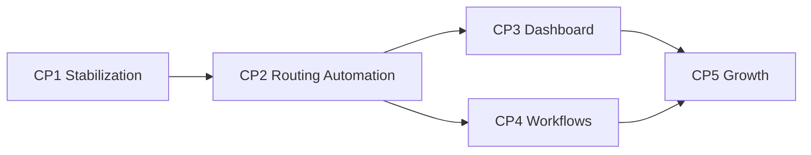

# תוכנית שיפור רציפה — daily-life-hacks.com

**תאריך:** 11 ביולי 2026  
**בסיס:** `docs/project-architecture-audit-2026-07-11.md`  
**סגנון:** תהליך רציף עם צ'קפוינטים סגורים (לא לפי שבועות)  
**כלל:** לא מתחילים צ'קפוינט הבא לפני שכל ה-validation של הנוכחי עובר.

---

## Checkpoint status

| Checkpoint | Status |
|------------|--------|
| CP1 Stabilization & SEO Cleanup | **DONE** (2026-07-11) |
| CP2 Pipeline & Routing Automation | **DONE** (Phase A+B on main) |
| CP3 Pipeline Reliability & Dashboard | **DONE** (CP3.1–3.5) |
| CP4 Workflows Unification | **DONE** — see `docs/cp4-workflows-closure.md` |
| CP5 Growth & Pinterest | **DONE** (CP5.1–5.6, 2026-07-12) — `docs/cp5-growth-pinterest-plan.md` |

---

## 1. Overview של האסטרטגיה

### מה נשנה ולמה

המערכת היום עובדת, אבל שברירית בגלל **שלוש שכבות routing לפינים**, **שני נתיבי publish**, ו**דשבורד מונוליתי**. המטרה היא לא לבנות מחדש מאפס — אלא לצמצם שכבות עד שנשאר מודל אחד ברור.

### מודל היעד (End State)

```
כתבה אחת קנונית:  /{article-slug}/     → index + sitemap
יעד פין ייחודי:    /{pin-destination}/  → 301 לקנוני + לוג D1
                                        (אין HTML כפול ב-dist)
מקור אמת אחד:      pipeline-data/pin-destinations.json
                   (נוצר/מתעדכן אוטומטית ב-produce)
Pinterest:         4+ פינים לכתבה, כל אחד עם link ייחודי + creative שונה
Publish:           staging → promote בלבד
Dashboard:         טאבים ממוקדים, בלי legacy פעיל
```

### עקרון מרכזי ל-SEO + Pinterest

| דרישה | פתרון |
|--------|--------|
| Google לא רואה duplicates | Pin destinations = **301** לקנוני (לא דפי HTML עם noindex) |
| Pinterest מקבל 4+ קישורים מגוונים | כל פין מקבל `url_slug` ייחודי שעדיין קיים כנתיב תקין |
| Attribution | `[[path]].js` רושם hit **לפני** ה-301 (`pinterest_hits`) |
| Build קל | אין 525 דפי alias ב-`getStaticPaths` |
| אמינות | Produce מעדכן registry + verify fail-closed |

### סדר הצ'קפוינטים (למה בסדר הזה)

1. **Stabilization** — לעצור נזק מיידי (אבטחה, noindex, מדיניות) בלי שבירת פינים קיימים  
2. **Routing Automation** — מעבר למודל 301 + registry אחד + אוטומציה ב-produce  
3. **Dashboard** — אחרי שהמודל יציב, לפשט את ה-UI סביבו  
4. **Workflows** — לאחד נתיבים כשיודעים מה ה-API/routing הסופי  
5. **Growth** — אופטימיזציית Pinterest רק כשהתשתית אמינה  

### כלל ברזל לכל הצ'קפוינטים

- לא מוחקים aliases קיימים לפני שיש תחליף runtime שעובד ב-prod.  
- לא משנים D1 / KV / produce בלי אישור מפורש באותו תור.  
- כל צ'קפוינט נגמר ב-`npm run build:checked` + רשימת URL checks.

---

## 2. צ'קפוינט 1 — Stabilization & SEO Cleanup

**מטרה:** לייצב את המצב הנוכחי, לסגור חורים קריטיים, ולהכין את הקרקע למעבר ל-301 — בלי לשבור פינים חיים.

**החלטת אסטרטגיה שנסגרת כאן (ולא מממשים עדיין את כל המעבר):**  
יעד SEO = **Pin destination → 301 → canonical**.  
ב-CP1 רק מתעדים, מקפיאים, ומנקים סיכונים. המימוש המלא ב-CP2.

---

### 2.1 מה בדיוק צריך לעשות

#### משימה 1.1 — אבטחה: הסרת preview password מהקליינט
- להסיר את הסיסמה ה-hardcoded מ-`src/pages/[slug].astro` (`?preview=...`).
- אם צריך preview לכתבות מתוזמנות: מנגנון server-side בלבד (header secret / cookie חתום / staging only) — או ביטול זמני של preview בפרודקשן.
- לסובב/להחליף כל סיסמה שנחשפה ב-git history (לפחות להתייחס אליה כ-compromised).

#### משימה 1.2 — הקפאת מודל ה-aliases (Freeze)
- להוסיף מסמך מדיניות קצר: **אין להוסיף aliases ידנית** עד CP2.
- Produce/סקריפטים: אזהרה ברורה אם מוסיפים alias בלי sync מלא (או fail אם אפשר בלי לשבור flow קיים).
- לתעד ב-`docs/pin-routing-policy.md` את מודל היעד (301) ואת המצב הזמני (static noindex).

#### משימה 1.3 — Audit מלא של noindex / canonical / sitemap
- לוודא שכל alias ב-`slug-aliases.json`:
  - נבנה ב-`[slug].astro`
  - מקבל `robots=noindex, follow`
  - מקבל `canonical` לכתבה הקנונית
  - **לא** מופיע ב-sitemap
- לוודא ש-KV proxy (`[[path]].js`) עדיין שם `X-Robots-Tag: noindex, follow` על proxies.
- לתקן אי-התאמות שנמצאות ב-audit (לא לשנות ארכיטקטורה — רק לתקן באגים).

#### משימה 1.4 — תיקוני SEO טכניים קטנים ובטוחים
- Breadcrumb schema: trailing slash על קטגוריות (`/recipes/` וכו').
- `og:type`: `website` לדפים שאינם כתבה; `article` רק לכתבות.
- לוודא `title` / `meta description` clamp נשארים תקינים.
- לא לגעת ב-JSON-LD של Recipe/FAQ מעבר לנדרש.

#### משימה 1.5 — Inventory + Drift Report (קריא לאדם)
- סקריפט חדש (או הרחבת `verify-routing.mjs`) שמדפיס דוח:
  - כמה aliases / כמה router variants / כמה חסרים / כמה orphan aliases
  - כמה כתבות בלי 4 pin destinations
  - האם כל `url_slug` ב-CSV האחרון / registry פותר לכתבה קיימת
- לשמור snapshot ב-`pipeline-data/reports/routing-audit-YYYY-MM-DD.json`

#### משימה 1.6 — הגנה על pin destinations קיימים
- לוודא ש-`npm run verify:pin-destinations` ו-`verify:routing` רצים ב-`build:checked` (כבר קיים — לחזק אם חלש).
- להפוך warnings קריטיים ל-**fail** רק אם בטוח שלא ישברו CI כרגע; אחרת: fail על errors + דוח warnings חובה ב-PR.
- לבדוק מדגם live: 5 canonicals + 10 aliases + 5 `-vN` (אם קיימים) + 3 tags.

#### משימה 1.7 — ניקוי סיכוני auth מיידיים (ללא refactor גדול)
- לא לשנות עדיין את כל הדשבורד.
- לתעד: כל קריאה עם `?key=` חייבת לעבור ל-header ב-CP3/CP4.
- לתקן רק אם יש endpoint פתוח בבירור בלי auth (אם יימצא ב-audit מהיר).

---

### 2.2 קבצים לשנות / ליצור

| פעולה | קובץ |
|--------|------|
| עריכה | `src/pages/[slug].astro` — הסרת preview password; breadcrumb slash |
| עריכה | `src/layouts/BaseLayout.astro` — `og:type` דינמי (prop) |
| עריכה | דפים שאינם כתבה (index, categories, about…) — העברת `ogType` אם צריך |
| יצירה | `docs/pin-routing-policy.md` — מדיניות זמנית + יעד 301 |
| יצירה/עריכה | `scripts/audit-routing.mjs` (או הרחבת `verify-routing.mjs`) |
| יצירה | `pipeline-data/reports/routing-audit-*.json` (פלט ריצה) |
| עריכה קלה | `scripts/verify-routing.mjs` — דיווח drift ברור יותר |
| עריכה קלה | `astro.config.mjs` — רק אם audit מגלה חור ב-sitemap exclude |
| עריכה | `docs/project-architecture-audit-2026-07-11.md` או לינק מ-CHANGELOG — סטטוס CP1 |
| **לא לגעת ב-CP1** | `functions/[[path]].js` (מעבר 301 מלא), `slug-aliases` bulk delete, produce automation, dashboard split, workflow merges |

---

### 2.3 סדר ביצוע מדויק

```
1.  ליצור docs/pin-routing-policy.md (Freeze + יעד 301)
2.  להריץ audit-routing / verify-routing על המצב הנוכחי → לשמור baseline report
3.  להסיר preview password מ-[slug].astro (+ החלטה: preview רק ב-staging / בוטל)
4.  לתקן breadcrumb trailing slash ב-[slug].astro
5.  להוסיף prop ogType ל-BaseLayout ולעדכן דפים
6.  לתקן חורי noindex/canonical/sitemap שמצא ה-audit (אם יש)
7.  לחזק verify-routing / verify-pin-destinations לפי הצורך
8.  npm run build:checked
9.  בדיקות live / preview URLs (רשימה למטה)
10. לעדכן סטטוס: CP1 = DONE רק אחרי כל ה-validation
```

---

### 2.4 בדיקות / Validation אחרי CP1

| בדיקה | קריטריון הצלחה |
|--------|----------------|
| `npm run build:checked` | עובר ללא errors |
| Routing audit report | נשמר; מספר aliases/variants מתועד |
| View-source על alias | `noindex` + canonical לקנוני |
| View-source על canonical released | `index, follow` (או DEFAULT_ROBOTS) + self-canonical |
| Sitemap | אין alias slugs; אין `/tag/`; אין dashboard |
| Preview password | לא מופיע ב-HTML/JS של הדף |
| מדגם 10 pin URLs | 200 (או proxy תקין) + noindex |
| מדגם 5 canonicals | 200 + indexable |
| Breadcrumb JSON-LD | URLs עם trailing slash |
| og:type | article רק בכתבות |

**Definition of Done — CP1:**  
המערכת לא נשברה, הסיכון הביטחוני נסגר, מדיניות ה-freeze כתובה, ויש baseline מספרי ל-drift לפני CP2.

---

### 2.5 סיכונים ופתרונות — CP1

| סיכון | פתרון |
|--------|--------|
| הסרת preview שוברת workflow עריכה | Preview רק על staging hostname, או secret ב-header שלא מגיע לקליינט |
| חיזוק verify ל-fail שובר CI | קודם report-only; אחר כך fail על מחלקה אחת (למשל missing article target) |
| שינוי og/breadcrumb שובר rich results | שינויים מינימליים; לבדוק JSON-LD ב-Rich Results Test על 2 כתבות |
| מישהו מוסיף aliases ידנית בזמן CP1 | מדיניות freeze + הערה ב-PR template / docs |
| Audit מגלה מאות orphans | לא למחוק ב-CP1 — לרשום ל-CP2 cleanup queue |

---

## 3. צ'קפוינט 2 — Pipeline & Routing Automation

**מטרה:** מקור אמת אחד ליעדי פינים, ביטול HTML כפול, אוטומציה מ-produce, ו-301 אמין ב-Cloudflare.

### 3.1 מה לעשות

1. **Registry אחד:** ליצור `pipeline-data/pin-destinations.json`  
   מבנה מוצע:
   ```json
   {
     "article-slug": {
       "canonical": "article-slug",
       "destinations": [
         { "id": "v1", "url_slug": "unique-keyword-slug", "title": "...", "image": "..." }
       ]
     }
   }
   ```
2. **מיגרציה:** לייצר את הקובץ מ-`router-mapping.json` + `slug-aliases.json` (סקריפט חד-פעמי + verify).
3. **לייצר sync אוטומטי ב-produce:** אחרי pin briefs — עדכון registry (מחליף את הצורך ב-`sync_router_mapping` ידני).
4. **להפסיק לבנות static alias pages** ב-`[slug].astro` `getStaticPaths` (רק canonical articles).
5. **`functions/[[path]].js`:**  
   - אם path הוא pin destination → לוג ל-D1 → **301** ל-`/{canonical}/` (לשמור query string רלוונטי אם צריך).  
   - להשאיר legacy `-vN` כ-301 לאותו מנגנון.  
   - KV: או deprecate הדרגתי, או לסנכרן מה-registry ב-promote (לא שתי אמיתות).
6. **CSV / post-pins:** לקרוא destinations מה-registry החדש בלבד.
7. **Verify fail-closed:** כל destination חייב לפתור לכתבה קיימת; produce לא commit בלי זה.
8. **Cleanup:** אחרי שה-301 חי ב-prod — להסיר תלות ב-`slug-aliases.json` (או להפוך אותו ל-generated artifact מיושן).

### 3.2 קבצים עיקריים

| פעולה | קובץ |
|--------|------|
| יצירה | `pipeline-data/pin-destinations.json` |
| יצירה | `scripts/NEW_PIPELINE_2026-05-08/sync_pin_destinations.py` |
| יצירה | `scripts/migrate-pin-destinations.mjs` (חד-פעמי) |
| עריכה | `src/pages/[slug].astro` — הסרת aliases מ-getStaticPaths |
| עריכה | `functions/[[path]].js` — resolve + 301 + log |
| עריכה | `astro.config.mjs` — sitemap exclude לפי registry החדש (או מיותר אם אין דפים) |
| עריכה | `generate_pinterest_csv.py`, `verify-routing.mjs`, `verify-pin-destinations.mjs` |
| עריכה | `pipeline-produce.yml` / `pipeline-article-assets.yml` — שלב sync + verify |
| עדכון | `docs/pin-routing-policy.md`, `.claude/rules/pinterest.md` |
| אופציונלי | סקריפט sync ל-KV **או** הסרת KV dependency |

### 3.3 סדר ביצוע

```
1. Migrate → pin-destinations.json + verify parity עם aliases/mapping
2. לכתוב resolver משותף (Node script + mirror logic ב-[[path]].js או JSON ב-bundle)
3. להוסיף 301 path ב-[[path]].js מאחורי flag / לצד soft proxy
4. Deploy staging → לבדוק מדגם destinations: 301 + Location נכון + D1 hit
5. להסיר aliases מ-getStaticPaths
6. לחבר produce → sync_pin_destinations אוטומטי
7. לעדכן CSV generator
8. build:checked + promote מדורג
9. Monitor GSC (404 / soft 404 / indexed aliases) שבוע אחרי — חלק מ-validation ארוך
10. Deprecate slug-aliases / KV לפי תוצאות
```

### 3.4 Validation

- Destination URL → `301: 301`, `Location: https://www.../{canonical}/`
- Canonical → 200, indexable, ב-sitemap
- Pinterest CSV links מצביעים ל-destinations קיימים
- Produce על כתבת ניסיון יוצר 4 destinations ב-registry אוטומטית
- `pinterest_hits` נרשם עם `versioned_slug` לפני redirect
- אין alias HTML תחת `dist/{alias}/index.html`
- GSC: ירידה הדרגתית ב-“Crawled – currently not indexed” על aliases ישנים

### 3.5 סיכונים ופתרונות

| סיכון | פתרון |
|--------|--------|
| Pinterest / users עם bookmark ל-alias | 301 שומר equity ומפנה נכון |
| איבוד מעקב | לוג לפני 301; אופציונלי `?pin=` שלא משפיע על canonical (לא מומלץ אם אפשר בלי) |
| KV ו-Git מתפצלים | מקור אמת = Git registry; KV רק cache שנגזר ממנו או מבוטל |
| Build/function לא רואה JSON | להבטיח שה-registry ב-output או נטען מ-KV מעודכן ב-deploy |
| שבירת פינים חיים בזמן מעבר | Dual-run: קודם 301 ב-function גם כשעדיין יש static files; אחר כך הסרת static |

---

## 4. צ'קפוינט 3 — Dashboard Refactor

**מטרה:** דשבורד שמיש ותואם למודל החדש — בלי 3 פייפליינים ובלי 4,850 שורות בקובץ אחד.

### 4.1 מה לעשות

1. **IA חדש — טאבים/sections ברורים:**
   - Overview (stats + workflow health)
   - Pipeline (discover / produce / promote בלבד)
   - Pins (queue, approve, post-now)
   - Analytics (Pinterest + top pages)
   - Legacy (מוסתר / read-only / למחיקה בהמשך)
2. **פיצול קוד:**  
   `dashboard.astro` דק + מודולי JS: `dashboard/overview.js`, `pipeline.js`, `pins.js`, `analytics.js`.
3. **הסרת dead code:** Clarity/traffic בלי DOM, tracker ריק, כפתורי legacy publish מהמסך הראשי.
4. **Auth:** סיסמה ב-`Authorization` / `x-api-key` header בלבד; להפסיק `?key=` ב-client החדש.
5. **פירוק `/api/dashboard`:** endpoints קטנים (`/api/stats-overview`, traffic, subs) — אפשר בהדרגה.
6. **יישור עותק:** אנגלית עקבית ב-UI (או עברית עקבית — לבחור אחת).
7. **Pipeline UI** מציג pin-destinations מה-registry החדש (CP2), לא שלושה מקורות.

### 4.2 קבצים

| פעולה | קובץ |
|--------|------|
| פיצול | `src/pages/dashboard.astro` → `src/components/dashboard/*` + `public/js/dashboard/*` או modules |
| עריכה | `functions/api/_dashboard-auth.js` + כל הקוראים עם `?key=` |
| עריכה | `functions/api/dashboard.js` (פירוק הדרגתי) |
| מחיקה/הסתרה | סקשני legacy ב-HTML/JS |
| עדכון | טקסטים/סטטוסים לפי `docs/content-production-control.md` |

### 4.3 סדר ביצוע

```
1. להגדיר wireframe טאבים (בלי לשנות API)
2. לחלץ JS ל-modules בלי שינוי התנהגות (behavior-preserving)
3. להוסיף tab UI + להסתיר Legacy
4. להעביר client auth ל-headers
5. להסיר dead sections
6. לפצל API כבד רק אחרי שה-UI יציב
7. בדיקות ידניות: login, produce trigger, pin approve, promote gate
```

### 4.4 Validation

- Login עובד ב-prod + staging  
- אין `?key=` ב-network tab של הדשבורד החדש  
- Pipeline / Pins / Overview נטענים בנפרד (כשל באחד לא שובר הכל)  
- אין כפתור “Legacy Publish to Main” במסך הראשי  
- Lighthouse/UX לא חובה — אבל זמן refresh של Overview יורד לעומת הכל-בבת-אחת  

### 4.5 סיכונים

| סיכון | פתרון |
|--------|--------|
| שבירת triggers ל-GitHub | רגרסיה ידנית לכל כפתור לפני merge |
| Staging proxy ל-topics | לרכז `isProductionRequest` ב-helper אחד לפני שינויים |
| Scope creep לעיצוב מלא | CP3 = מבנה + ניקוי; לא redesign ויזואלי גדול |

---

## 5. צ'קפוינט 4 — Workflows Unification & Reliability

**מטרה:** נתיב אחד אמין מ-topic עד live, בלי deploy כפול ובלי scripts מתים.

### 5.1 מה לעשות

1. **Publish path יחיד:** `pipeline-produce` → review → `promote-staging`.  
   - `publish-articles.yml`: להפוך ל-disabled / archive / או רק release-gate ל-`publishAt` אם עדיין נחוץ בנפרד — לתעד החלטה.
2. **למחוק או לאחד `pipeline-daily.yml`** לתוך `pipeline-produce` (inputs).
3. **Deploy:**  
   - או: promote רק merge+push ומסתמך על `deploy-cloudflare-pages`  
   - או: promote רק wrangler deploy בלי dual  
   - לא שניהם.
4. **Produce job:** sync pin-destinations + verify + build gate + D1 sync fail-closed (כפי ש-`content-production-control.md` דורש).
5. **להסיר test crons מתים** מ-`publish-articles.yml`.
6. **CI על PR:** workflow חדש `ci.yml` — `npm run build:checked` על PRs ל-`main`/`staging`.
7. **Secrets hygiene:** pins-upload/reschedule — headers במקום query string.
8. **Concurrency groups** ברורים כדי למנוע cancel של promote.

### 5.2 קבצים

| פעולה | קובץ |
|--------|------|
| עריכה/מחיקה | `.github/workflows/pipeline-daily.yml` |
| עריכה | `promote-staging.yml`, `deploy-cloudflare-pages.yml`, `pipeline-produce.yml` |
| יצירה | `.github/workflows/ci.yml` |
| עריכה | `pins-upload-csv.yml`, `pins-reschedule.yml` |
| ארכיון | legacy article publish scripts אם מבוטלים |
| עדכון | `docs/content-production-control.md` — enforcement שבוצע |

### 5.3 סדר ביצוע

```
1. CI על PR (בטוח, לא משנה prod)
2. איחוד pipeline-daily → produce
3. תיקון deploy dual (promote vs push deploy)
4. Fail-closed gates ב-produce
5. השבתת/תיעוד publish-articles legacy
6. Headers במקום query keys
7. Dry-run promote על staging content קטן
```

### 5.4 Validation

- PR אדום כש-`build:checked` נכשל  
- Produce אחד → staging URLs + registry + D1 sync  
- Promote אחד → main חי בלי double-deploy מבלבל בלוגים  
- post-pins ממשיך לרוץ  
- אין workflow “daily” כפול  

### 5.5 סיכונים

| סיכון | פתרון |
|--------|--------|
| ביטול publish-articles שובר publishAt | להשאיר רק את החלק של release/rebuild אם צריך; או להסתמך על deploy היומי ב-06:15 |
| שינוי concurrency שובר deploy | לבדוק run אחד ידני אחרי השינוי |
| GH_PAT permissions | לבדוק scopes לפני השבתת paths |

---

## 6. צ'קפוינט 5 — Growth & Pinterest Optimization

**מטרה:** אחרי תשתית יציבה — לשפר גיוון, תפוקה ומדידה של פינים (4+ לכל כתבה).

### 6.1 מה לעשות

1. **הבטחת 4 destinations לכל כתבה חדשה** (gate ב-produce).  
2. Backfill אופציונלי לכתבות ישנות בלי 4 destinations (batch ידני/מוגבל).  
3. **גיוון creatives:** להמשיך 4 מודלי FAL שונים; A/B על כותרות ב-pin briefs.  
4. **Board strategy:** אוטומציה זהירה דרך `pinterest-boards` + כללי בחירת board לפי category/tags.  
5. **Analytics loop:** מהדשבורד לראות איזה destination/creative מביא clicks → feedback ל-brief prompts.  
6. **Rich pin metadata verify** אחרי promote (כבר קיים חלקית) — להפוך לחובה.  
7. **לא** לחזור ל-HTML duplicates בשם “growth”.

### 6.2 קבצים

| פעולה | קובץ |
|--------|------|
| עריכה | `generate_pin_briefs.py`, `verify_pipeline_artifacts.py` |
| עריכה | dashboard Pins/Analytics tabs |
| עריכה | `generate_pinterest_csv.py` — scheduling policy |
| אופציונלי | backfill script לכתבות חסרות |
| עדכון | `.claude/rules/pinterest.md` / skill post-pin |

### 6.3 Validation

- כתבה חדשה → בדיוק 4+ destinations ב-registry + 4 תמונות + 4 queued rows אחרי approve  
- כל link ב-CSV מחזיר 301→canonical  
- אנליטיקס מציג breakdown לפי destination slug  
- אין עלייה ב-indexed duplicates ב-GSC  

### 6.4 סיכונים

| סיכון | פתרון |
|--------|--------|
| Rate limits Pinterest | להשאיר MAX_PINS_PER_RUN=1; לייעל quality לא quantity עיוור |
| Backfill המוני | batches קטנים + verify אחרי כל batch |
| Over-automation של boards | create boards רק עם flag מפורש |

---

## 7. מפת תלויות בין צ'קפוינטים



- CP3 ו-CP4 יכולים חלקית במקביל **אחרי** CP2 (כי שניהם תלויים ב-registry/301).  
- CP5 רק אחרי CP2 + (CP3 או CP4 מינימלי למדידה/תור).

---

## 8. מה לא עושים בתוכנית הזו

- לא עוברים ל-SSR מלא / framework אחר.  
- לא מאחדים D1 staging+prod ל-DB אחד בלי משימה נפרדת.  
- לא בונים redesign ויזואלי לאתר הציבורי.  
- לא מגדילים קצב פוסטים לפני ש-routing יציב.  
- לא משאירים soft-duplicate HTML כפתרון קבוע.

---

## 9. הצעד הבא המיידי

**סטטוס:** CP1–CP5 סגורים (2026-07-12). Growth נכנס ל**ריצה שוטפת**: score pins שבועי, experiments log, GSC spot-check, PDFs ל-magnets כשיהיו מוכנים.

### החלטות שאושרו
1. **יעד SEO לפינים = 301 לקנוני** — מאושר.
2. **Preview:** אין סיסמה בקליינט; unlock רק על staging / Pages preview / localhost.
3. **Publish path:** staging → promote בלבד; legacy publisher בארכיון.
4. **Deploy:** רק `deploy-cloudflare-pages.yml`, concurrency לפי branch.
5. **Idea Pin automation:** NO-GO עד 5 בדיקות ידניות (`docs/idea-pin-automation-gate.md`).

ראה גם: `docs/pin-routing-policy.md`, `docs/cp4-workflows-closure.md`, `docs/cp5-growth-pinterest-plan.md`, `docs/growth-experiments.md`.
